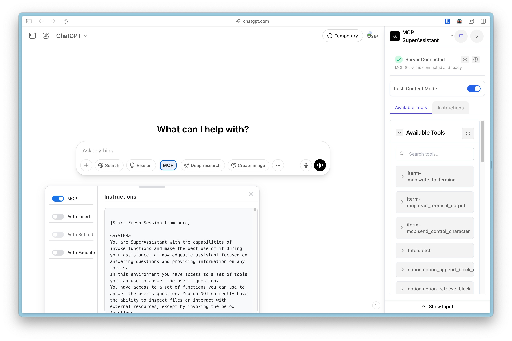
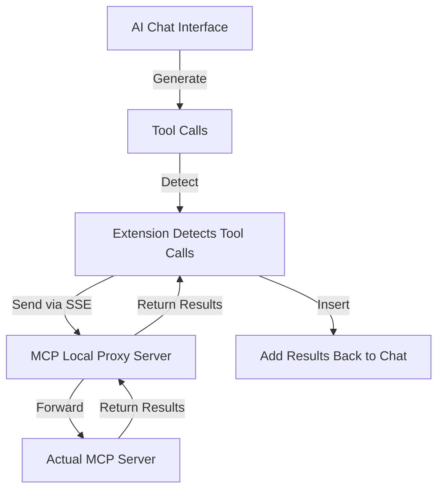

<div align="center">
   <!--  -->
   <h1>MCP SuperAssistant Chrome Extension</h1>
</div>

<p align="center">
Brings MCP to ChatGPT, Perplexity, Grok, Gemini, Google AI Studio, OpenRouter and more...
</p>

<!--  -->
<div align="center">
 
</div>

## Overview

MCP SuperAssistant is a Chrome extension that integrates the Model Context Protocol (MCP) tools with AI platforms like Perplexity, ChatGPT, Google Gemini, Google AI Studio and Grok. It allows users to execute MCP tools directly from these platforms and insert the results back into the conversation, enhancing the capabilities of web-based AI assistants.

## Currently Supported Platforms

- [ChatGPT](https://chatgpt.com/)
- [Google Gemini](https://gemini.google.com/)
- [Perplexity](https://perplexity.ai/)
- [Grok](https://grok.com/)
- [Google AI Studio](https://aistudio.google.com/)
- [OpenRouter Chat](https://openrouter.ai/chat)
- [DeepSeek](https://chat.deepseek.com/)
- [Kagi](https://kagi.com/assistant)
- [T3 Chat](https://t3.chat/)


More platforms coming soon! Pull Requests are welcome.

## Demo Video

[](https://www.youtube.com/watch?v=PY0SKjtmy4E)

Watch the demo to see MCP SuperAssistant in action!

[MCP SuperAssistant Demo Playlist](https://www.youtube.com/playlist?list=PLOK1DBnkeaJFzxC4M-z7TU7_j04SShX_w)

## What is MCP?

The Model Context Protocol (MCP) is an open standard developed by Anthropic that connects AI assistants to systems where data actually lives, including content repositories, business tools, and development environments. It serves as a universal protocol that enables AI systems to securely and dynamically interact with data sources in real time.

## Key Features

- **Multiple AI Platform Support**: Works with ChatGPT, Perplexity, Google Gemini, Grok, Google AI Studio, OpenRouter Chat, DeepSeek, Kagi, T3 Chat!
- **Sidebar UI**: Clean, unobtrusive interface that integrates with the AI platform
- **Tool Detection**: Automatically detects MCP tool calls in AI responses
- **Tool Execution**: Execute MCP tools with a single click
- **Tool Result Integration**: Seamlessly insert tool execution results back into the AI conversation
- **Render Mode**: Renders Function call and Function results. 
- **Auto-Execute Mode**: Automatically execute detected tools
- **Auto-Submit Mode**: Automatically submit chat input after result insertion
- **Push Content Mode**: Option to push page content instead of overlaying
- **Preferences Persistence**: Remembers sidebar position, size, and settings
- **Dark/Light Mode Support**: Adapts to the AI platform's theme

## How It Works



## Installation

### From Chrome Web Store

1. Visit the [Chrome Web Store page](https://chromewebstore.google.com/detail/mcp-superassistant/kngiafgkdnlkgmefdafaibkibegkcaef?hl=en) for MCP SuperAssistant
2. Click "Add to Chrome"
3. Confirm the installation

### Connecting to Local Proxy Server

To connect the Chrome extension to a local server for proxying connections:

#### Run MCP SuperAssistant Proxy via npx:

   ```bash
   npx @srbhptl39/mcp-superassistant-proxy@latest --config ./mcpconfig.json
   ```
   
   This is useful for:
   - Proxying remote MCP servers
   - Adding CORS support to remote servers
   - Providing health endpoints for monitoring

   Use existing MCP config file if available.
   ```
   macOS: ~/Library/Application Support/Claude/claude_desktop_config.json
   Windows: %APPDATA%\Claude\claude_desktop_config.json
   ```

#### Connection Steps:

1. Start the proxy server using one of the commands above
2. Open the MCP SuperAssistant sidebar in your AI platform
3. Click on the server status indicator (usually showing as "Disconnected")
4. Enter the local server URL (default: `http://localhost:3006`)
5. Click "Connect" to establish the connection
6. The status indicator should change to "Connected" if successful

## Usage

1. Navigate to a supported AI platform.
2. The MCP SuperAssistant sidebar will appear on the right side of the page
3. Configure your MCP server by clicking on the server status indicator
4. Interact with the AI and use MCP tools by:
   - Waiting for the AI to suggest a tool (auto-detected)
   - Executing the tool via the sidebar
   - Viewing the result and inserting it back into the conversation


## Tips & Tricks

1. **Turn off search mode** (chatgpt, perplexity) in AI chat interfaces for better tool call prompt experience and to prevent MCP SuperAssistant from getting derail.
2. **Turn on Reasoning mode** (chatgpt, perplexity, grok) in AI chat interfaces, which will help the AI to understand the context better and generate the correct tool calls.
3. Use newer high-end models as they are better at understanding the context and generating the correct tool calls.
4. Copy the MCP instructions prompt and paste it in the AI chat system prompt (Google AI Studio).
5. Mention the specific tools you want to use in your conversation.
6. Use the MCP Auto toggles to control the tool execution.

## Common Issues with MCP SuperAssistant

This page covers the most common issues users encounter with MCP SuperAssistant and provides solutions to resolve them.

### 1. Extension Not Detecting Tool Calls

- Make sure the extension is enabled in your browser.
- Make sure the **mcp prompt instructions are properly attached or inserted** in the chat, before starting any chat.
- Check that your AI platform supports tool calls and that the feature is enabled.
- Refresh the page or restart your browser if the issue persists.

### 2. Tool Execution Fails

- Ensure your proxy server is running and the URL is correct in the sidebar server settings.
- check your mcpconfig.json file for any errors or formatting issues.
- Check your network connectivity and firewall settings.

### 3. Connection Issues

- Ensure that your MCP server is running and accessible.
- Check the server URL in the extension settings.
- First start the npx mcp-SuperAssistant-proxy server and then reload/restart the extension from chrome://extensions/ page.
- Check the proxy server logs for any errors or issues.
- Ensure that your firewall or antivirus software is not blocking the connection.
- Make sure the server shows the proper connected status and exposes the `/sse` endpoint.


### Manual Installation (Development)

#### Release Version
1. Download the latest release from [Releases](https://github.com/srbhptl39/MCP-SuperAssistant/releases)
2. Unzip the downloaded file
3. Navigate to `chrome://extensions/` in Chrome
4. Enable "Developer mode"
5. Click "Load unpacked" and select the unzipped directory
6. Follow [Connecting to Local Proxy Server](#connecting-to-local-proxy-server) to connect to your MCP server

## Development

### Prerequisites

- Node.js (v16+)
- pnpm

### Setup

```bash
# Install dependencies
pnpm install

# Start development server
pnpm dev

# Build for production
pnpm build

# Create zip package for distribution
pnpm zip
```

## Contributing

Contributions are welcome! Please feel free to submit a Pull Request.

1. Fork the repository
2. Create your feature branch (`git checkout -b feature/amazing-feature`)
3. Commit your changes (`git commit -m 'Add some amazing feature'`)
4. Push to the branch (`git push origin feature/amazing-feature`)
5. Open a Pull Request

## License

This project is licensed under the MIT License - see the LICENSE file for details.

## Acknowledgments

- Inspired by the [Model Context Protocol (MCP)](https://modelcontextprotocol.io/) by Anthropic
- Thanks to [Cline](https://github.com/cline/cline) for idea inspiration
- Built with [Chrome Extension Boilerplate with React + Vite](https://github.com/Jonghakseo/chrome-extension-boilerplate-react-vite)


## Star History

[](https://www.star-history.com/#srbhptl39/MCP-SuperAssistant&Date)